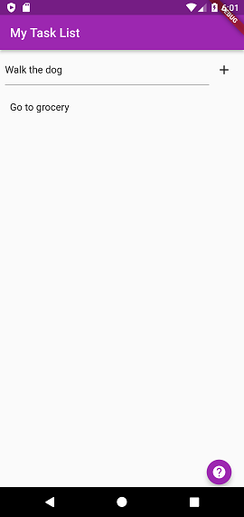

# To Do List

This project is my first Flutter App and it is for study purpose, in this app is possible to add or remove tasks from a list in memory, to scroll up and down (when the list becomes bigger) and by a long press it's going to show a dialog to confirm the exclusion of that task.


<div align="center">
<br>

| Adding item | Removing item
| :---: | :---: |
| |  |


|     STACKS    |
|      :---:    | 
|   | 


| PROJECT STATUS   |                      Developer                   |
|        :---:     |                         :---:                    |  
| 	In progress    |   [Kyara Araújo](https://github.com/kyaraaraujo) | 


<br>


---

## Table of Contents

[Added](#added) &nbsp;&nbsp; | &nbsp;&nbsp; 
[Reminders](#reminders) &nbsp;&nbsp; | &nbsp;&nbsp; 
[How to run](#how-to-run) &nbsp;&nbsp; | &nbsp;&nbsp; 
[To Do](#to-do) &nbsp;&nbsp; | &nbsp;&nbsp; 
[References](#references) &nbsp;&nbsp; 

</div>
<br>


## Added
- Won't allow adding to list if text input is:
  - empty: doesn't have value `''`
  - blank: has only white spaces `'     '`
- Remove from list when the item is long pressed
  - A dialog(`AlertDialog`) will show up asking to confirm or cancel.

## Reminders
- Basically eveything on Flutter is a `Widget`, some properties also expects to receive a widget.

- `Row` and `Column` can have children (more rows and/or columns), a row can have a column as child and vice-versa.
  - The `Expanded` property in a `Row`/`Column` will expand its size in the screen: horizontal for `Row` and vertical for `Column`. It's suggested to use it to avoid some erros like hasSize, `Expanded` can be used in the father or child widget.

- Property → `padding: EdgeInsets.all(24)` → *.all means all directions.*
  - Enpsulating a widget with `Padding` will afect all its children.
    ```Dart
      Padding(
        padding: const EdgeInsets.all(8.0),
        child: Row(
          // ...
        )
      )
    ```
- `TextField` → for text input
    - It has a property called `TextEditingController`, when a widget has a property that contains the word controller it means we can have access to many other functions like .value, .text, .clear, etc. We can “control” that field.

- `setState() { }` → is a function that will show the changes inside { } in the screen.


## **How to run**
- [Install Flutter](https://flutter.dev/) if you don't have it.
- Have an IDE: Visual Studio Code (VSCode), Android Studio, or Xcode
  - Visual Studio Code extensions: 
    - [Flutter](https://marketplace.visualstudio.com/items?itemName=Dart-Code.flutter)
    - [Dart](https://marketplace.visualstudio.com/items?itemName=Dart-Code.dart-code)
- Have a physical smartphone or an emulator (for an Android emulator, can be created in Android Studio or VSCode)
- Run the app (F5 in VSCode or Run App button in Android Studio)

<br>

### To Do

- [x] ~~Change color of the App Bar~~

- [ ] Add a help Button

- [x] ~~Separate Dialog from home_page.~~

- [ ] Unit Tests


## References
- [To do list by Jacob Moura](https://www.youtube.com/watch?v=Hq7JFYQEQjw&list=PLlBnICoI-g-fuy5jZiCufhFip1BlBswI7&index=26)

- [Deleting the item from list by Deivid Willyan](https://www.youtube.com/watch?v=PlB25Z3ma8E&list=PLRpTFz5_57cvo0CHf-AnojOvpznz8YO7S&index=9)

- [Doc - AlertDialog to confirm exclusion](https://api.flutter.dev/flutter/material/AlertDialog-class.html)

- [A reusable AlertDialog](https://www.youtube.com/watch?v=CXO7tKEVjI4)
  - [source code](https://github.com/TheTechDesigner/AlertDialog-Logout)

  
<br>

---
⬆ [Back to top](#to-do-list)

<br>
